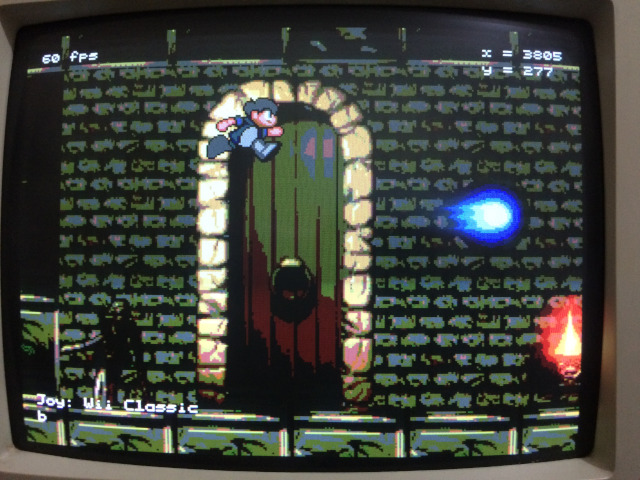
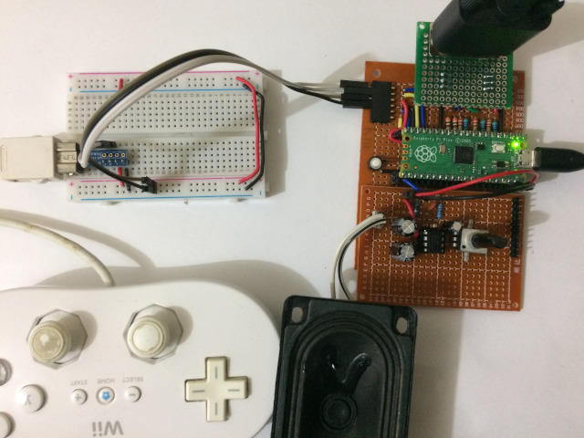
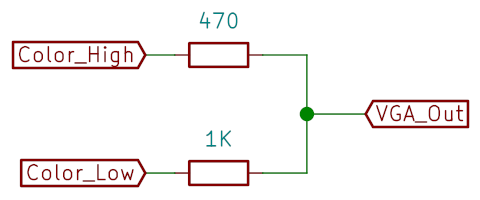
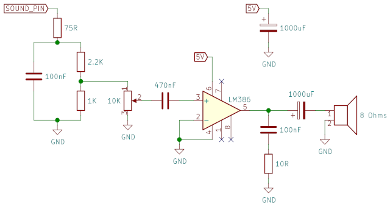

# pico-loser

This is an old game, Loser Corps, ported to the Raspberry Pi Pico. It features:

- VGA output with 64 colors at 320x240
- Sound output using 22050Hz/mono/8 bits (mixing up to 4 sounds plus mod player) with a simple MOD player
- Wii nunchuk and Wii classic controller support via I2C

Here's the Pico connected to the VGA monitor, speaker and Wii classic
controller:

## Compilation

The `game` directory contains a CMake project that uses the official
[pico-sdk](https://github.com/raspberrypi/pico-sdk). To build using
the command line, install and set up the the Pico SDK, then:

    git clone https://github.com/moefh/pico-loser.git
    cd pico-loser
    mkdir build
    cd build
    cmake ..
    make

This will create the file `game/pico-loser.uf2` inside the `build`
directory you created. To run the game, start the Pico in BOOTSEL mode
(plug the USB cable while holding the BOOTSEL button) and copy the
file `pico-loser.uf2` to the Pico folder that appears.

## VGA Output

The VGA output has 2 bits per color channel (which results in an image
of 64 colors). As shown in the photo above, I use a homemade
perfboard with a few resistors.

The output pins (which can be changed in `game/main.c`) are configured as:

|  Pico GPIO |  Output signal  |
|-----------:|-----------------|
|          2 | Red low         |
|          3 | Red high        |
|          4 | Green low       |
|          5 | Green high      |
|          6 | Blue low        |
|          7 | Blue high       |
|          8 | Horizontal sync |
|          9 | Vertical sync   |

The vertical sync and horizontal sync pins should each be connected to
the monitor cable through an appropriate resistor (I use 300 Ω).

For each color component (red, green, blue), a resistor ladder or some
other form of DAC is needed to convert the 2 digital pin outputs to
the corresponding analog voltage expected by the VGA monitor. I use
this simple setup with 2 resistors:

It doesn't match the VGA monitor impedance (the output impedance is
1/(1/470+1/1000)=320Ω, where the monitor input impedance is 75Ω) but
the image doesn't look bad, even with my old CRT monitor.  My old
attempt at matching the impedance with 3 resistors (270Ω for high,
480Ω for low, and a 130Ω to ground) exceeds the maximum output current
for the Pico by a bit (when adding all pins), so it's not recommended.

## Sound Output

Sound output is sent to GPIO 16. The code is based on Greg Chadwick's
PWM sound generation described in [this blog
post](https://gregchadwick.co.uk/blog/playing-with-the-pico-pt3/).

I'm using an LM386 to amplify the sound and connect to an 8 Ω speaker
using this schematic:

## Controller Support

The game supports the Wii Nunchuk and the Wii Classic Controller using
I2C. The controller pins should be connected as follows:

| Pico Pin         | Controller   |
|-----------------:|--------------|
| 3V3 OUT (pin 36) | 3V3          |
| Any GND pin      | GND          |
| GPIO 12          | SDA (data)   |
| GPIO 13          | SCL (clock)  |

You can use breakout board [like this one from
Adafruit](https://www.adafruit.com/product/4836), or (if you're OK
with destroying you controller's plug) follow [this
tutorial](https://create.arduino.cc/projecthub/infusion/using-a-wii-nunchuk-with-arduino-597254).

## License

The source code and images are released under GPL 2.0

Includes the song
"[The Soft-liner](https://modarchive.org/index.php?request=view_by_moduleid&query=61156)"
by Zilly Mike, licensed under [CC BY
3.0](https://creativecommons.org/licenses/by/3.0/).  No changes were
made other than the conversion to a header file for inclusion in the
code.
