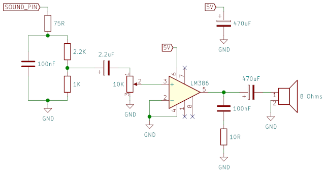

# pico-loser

This is an old game, Loser Corps, ported to the Raspberry Pi Pico.
It features:

- VGA output with 64 colors at 320x240, 60Hz
- Sound output using 22050Hz/mono/8 bits (a simple MOD player for
music plus up to 4 simultaneous sound effects)
- Wii nunchuk and Wii classic controller support via I2C


Here's the Pico connected to a VGA plug, a speaker and a Wii classic
controller:


## Compilation

The code contains a CMake project that uses the official
[pico-sdk](https://github.com/raspberrypi/pico-sdk). To build it
using the command line, install the Pico SDK and then:

```bash
# set the pico-sdk path (not needed if you used the pico-sdk installation script)
export PICO_SDK_PATH=/path/to/your/pico-sdk

# download this repository
git clone https://github.com/moefh/pico-loser.git
cd pico-loser

# build the game executable
mkdir build
cd build
cmake ..
make
```

This will create the file `game/pico-loser.uf2` inside the `build`
directory you created. To run the game, start the Pico in BOOTSEL
mode (plug the USB cable while holding the BOOTSEL button) and copy
the file `pico-loser.uf2` to the Pico folder that appears.


## VGA Output

The VGA output has 2 bits per color channel (which can generate up to
64 colors). As shown in the photo above, I use a homemade perfboard
with a few resistors.

The VGA output pins must be sequential and are configured by default
according to the table below (the lowest pin number can be changed
in [game/main.c](game/main.c)):

|  Pico GPIO |  Output signal  |
|-----------:|-----------------|
|          2 | Red low         |
|          3 | Red high        |
|          4 | Green low       |
|          5 | Green high      |
|          6 | Blue low        |
|          7 | Blue high       |
|          8 | Horizontal sync |
|          9 | Vertical sync   |

The vertical sync and horizontal sync pins should each be connected to
the monitor cable through an appropriate resistor (I use 300 Ω, but
330 Ω would probably work as well).

For each color component (red, green, blue), a resistor ladder or some
other form of DAC is needed to convert the 2 digital pin outputs to
the corresponding analog voltage expected by the VGA monitor. I use
this simple setup with 2 resistors for each color:


This setup doesn't match the VGA monitor impedance (the output
impedance is 1/(1/470+1/1000)=320Ω, but the monitor input
impedance is 75Ω) but the image doesn't look bad, even with my
old CRT monitor.  My old attempt at matching the impedance with
3 resistors (270Ω for high, 480Ω for low, and a 130Ω to ground)
exceeds the maximum output current for the Pico by a bit (when
adding all pins), so it's not recommended.

Here is full schematic of all required connections to a VGA
female port:


## Video Modes

The default output mode is 320x240 at 60 Hz, but the video signal
generation code is able to output different video modes. For that,
the code needs to know the pixel and line timings of the desired
mode. A few standard video modes are defined in the code, see "VGA
mode definitions" in [game/lib/vga_6bit.c](game/lib/vga_6bit.c) for
a list of the included modes and an explanation of how the timings
are configured.

The Internet is full of resources describing the standard VGA mode
timings, but beware that not all monitors support all modes, and
some old CRT monitors get really angry when supplied with an
unsupported or invalid signal (the default 320x240 is pretty safe,
as it will be seen by the monitor as the ultra-standard
640x480@60Hz). Some great resources are:

 - http://tinyvga.com/vga-timing
 - https://projectf.io/posts/video-timings-vga-720p-1080p

If you want to use a different video mode, note that the vertical
and horizontal polarities of the selected video mode must be baked
in the image bits. The [images in the code](game/data/) have both
vertical and horizontal bits set to 1, since the default 320x240
mode uses negative polarities for both vertical and horizontal sync
pulses -- this means that the sync pulses are low, so outside the
pulses (like when the visible pixels are being sent) the vertical
and horizontal signals must be high. If you select a video mode with
a different polarity (see the values for `(h,v)pol` in the [video
mode definitions](game/lib/vga_6bit.c)), then you must change the
sync bits in the [image conversion
script](converters/image/conv_all.sh) and re-run it to rebuild the
images with the new sync bits.


## Sound Output

The sound is produced as a single stream of 8-bit samples at 22050 Hz
using a very simple [MOD
player](https://en.wikipedia.org/wiki/MOD_(file_format)) and a mixer
that takes the output of the MOD player and up to 4 samples at the
same time (this limit can easily [be
increased](game/lib/audio_mixer.h) at the cost of increased CPU use).

Since the Pico doesn't have a DAC, the resulting 8-bit samples are
converted and sent to GPIO 16 as PWM. The code that does this
conversion is based on Greg Chadwick's PWM sound generator described
in [this blog
post](https://gregchadwick.co.uk/blog/playing-with-the-pico-pt3/).

The PWM output from GPIO 16 is filtered with a 100nF capacitor and
a few resistors. The result is fed to an LM386 amplifier, which is
connected to an 8 Ω speaker. The whole thing is described in this
schematic:




## Controller Support

The game supports the Wii Nunchuk and the Wii Classic Controller
using I2C. The controller pins should be connected as follows:

| Pico Pin         | Controller   |
|-----------------:|--------------|
| 3V3 OUT (pin 36) | 3V3          |
| Any GND          | GND          |
| GPIO 12          | SDA (data)   |
| GPIO 13          | SCL (clock)  |

To make the connections, you can use a breakout board [like this one
from Adafruit](https://www.adafruit.com/product/4836), or (if you're
OK with destroying you controller's plug) follow [this
tutorial](https://create.arduino.cc/projecthub/infusion/using-a-wii-nunchuk-with-arduino-597254).


## License

The source code and images are released under GPL 2.0

Includes the song "[The
Soft-liner](https://modarchive.org/index.php?request=view_by_moduleid&query=61156)"
by Zilly Mike, licensed under [CC BY
3.0](https://creativecommons.org/licenses/by/3.0/).  No changes were
made other than the conversion to a header file for inclusion in the
code.
